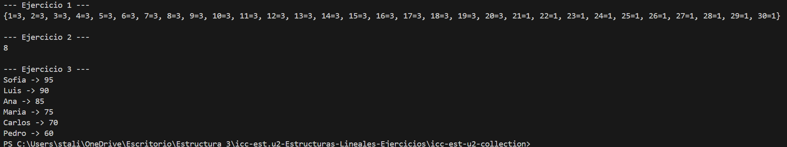

# Práctica: Estructuras No Lineales - 

## Autor
- Nombre: Javier Barrezueta
- Carrera/Curso: Estructura de datos

##  Nombre de la práctica - Fecha
- Práctica: Maps Ejercicios
- Fecha: 2026-01-19

## Descripción
En esta práctica se implementaron algoritmos de manipulación de datos utilizando la estructura Map (HashMap) en Java. Se desarrollaron soluciones eficientes para el conteo de frecuencias y la identificación de elementos únicos (primer no repetido). Además, se aplicó lógica de agrupación y filtrado para conservar valores máximos asociados a claves específicas (puntajes de jugadores y notas por carrera), finalizando con el ordenamiento de los resultados para la generación de reportes y rankings.

## Evidencias
### Captura 1
Inserta aquí la captura del código o de la ejecución.

